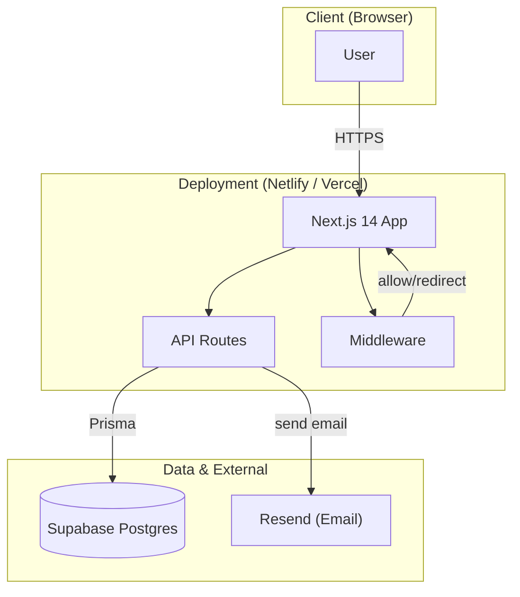
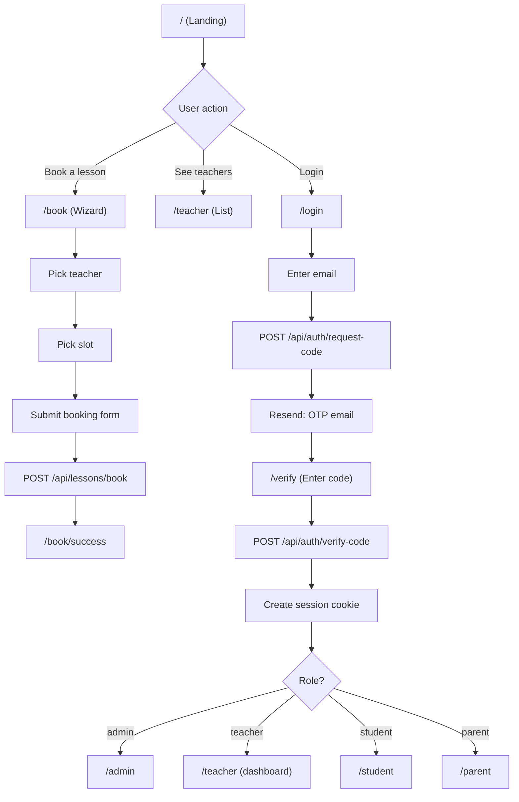
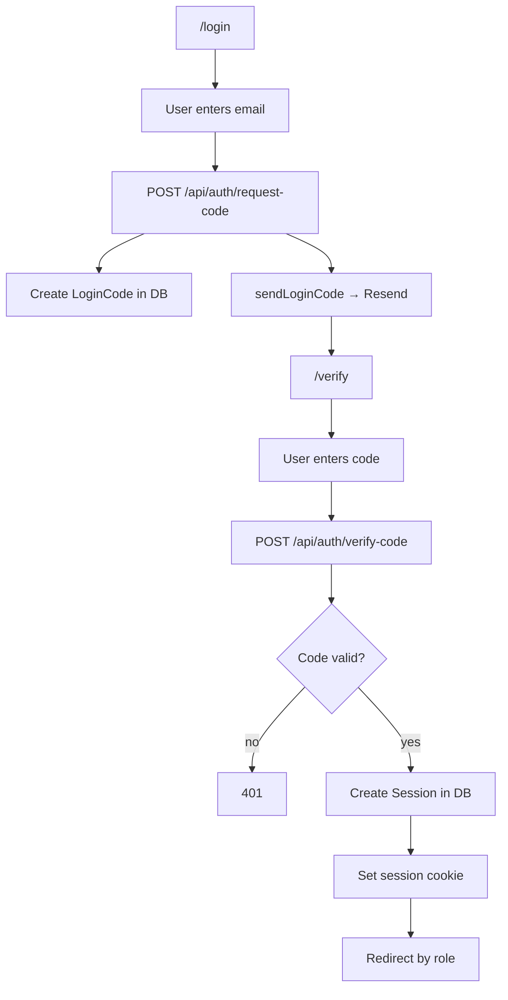
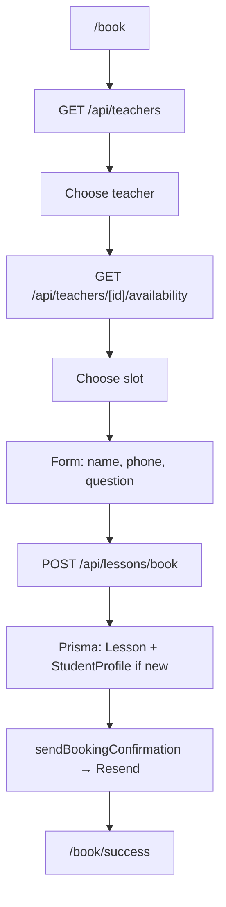
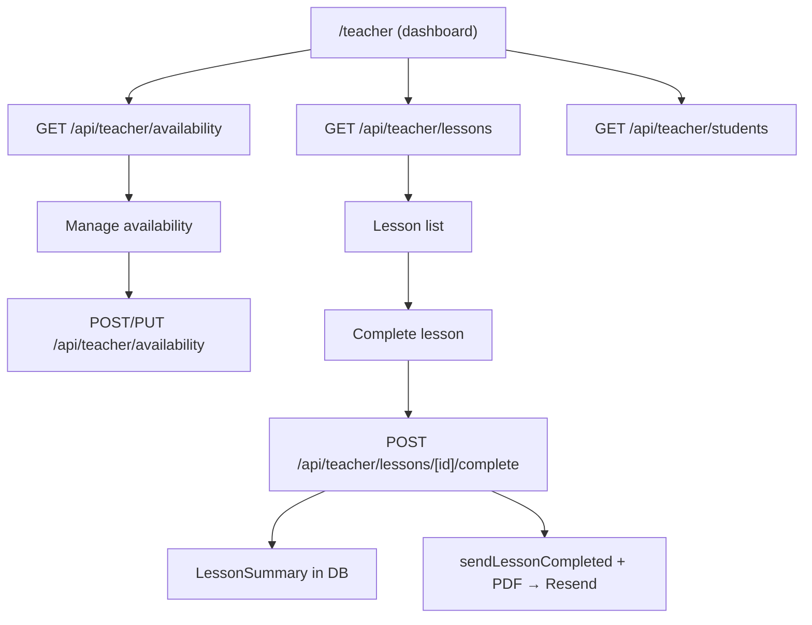
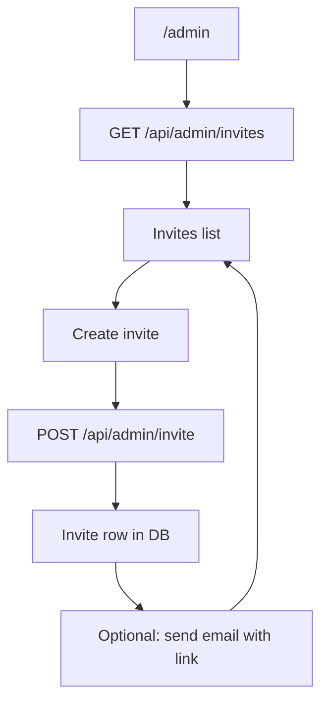
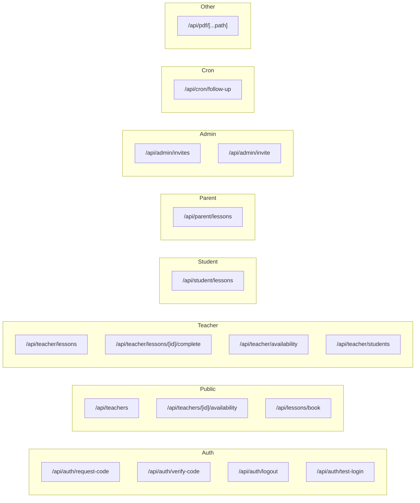
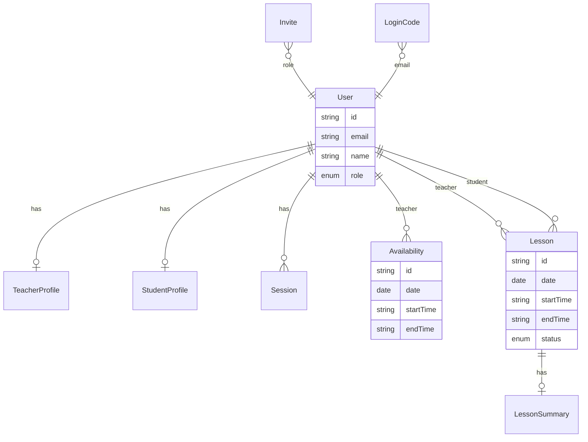
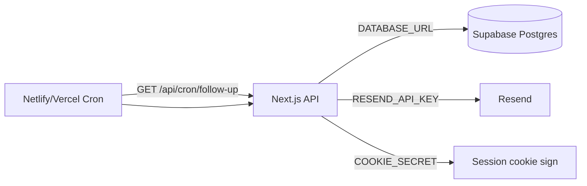

# Paza Lessons — Architecture Flowchart

High-level and flow-level architecture in flowchart form (Mermaid). Render in GitHub, VS Code (Mermaid extension), or [mermaid.live](https://mermaid.live).

---

## 1. System overview



---

## 2. Request flow (middleware & routes)

```mermaid
flowchart LR
  Request[Request] --> MW{Middleware}
  MW -->|"/" "/login" "/verify" "/book" "/teacher*" "/api/auth*" "/api/cron*"| Allow[Allow]
  MW -->|other path| Cookie{Session cookie?}
  Cookie -->|no| Redirect["Redirect → /login"]
  Cookie -->|yes| Allow
  Allow --> App[App / API]
```

---

## 3. Page & role flow (user journeys)



---

## 4. Auth flow (login & session)



---

## 5. Booking flow (public)



---

## 6. Teacher flow (lessons & completion)



---

## 7. Admin flow (invites)



---

## 8. API routes map



---

## 9. Data model (Prisma → Supabase)



---

## 10. External services



---

## Summary table

| Layer        | Tech / Location |
|-------------|------------------|
| Frontend    | Next.js 14 (App Router), React, Tailwind, RTL (Heebo) |
| Auth        | Session cookie, LoginCode + verify, Invite for teachers |
| API         | Next.js Route Handlers under `/api` |
| Database    | Supabase (Postgres), Prisma ORM |
| Email       | Resend (OTP, booking, lesson summary, follow-up) |
| Hosting     | Netlify or Vercel |
| Cron        | Follow-up reminders via host cron → `/api/cron/follow-up` |
